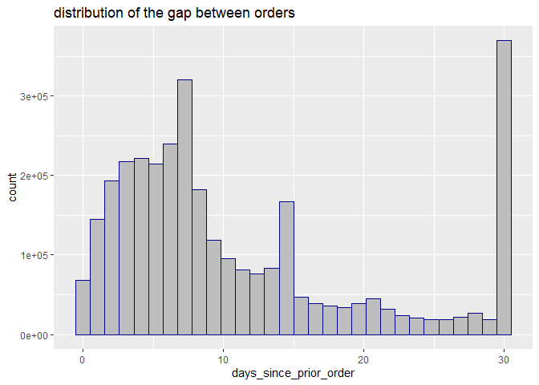
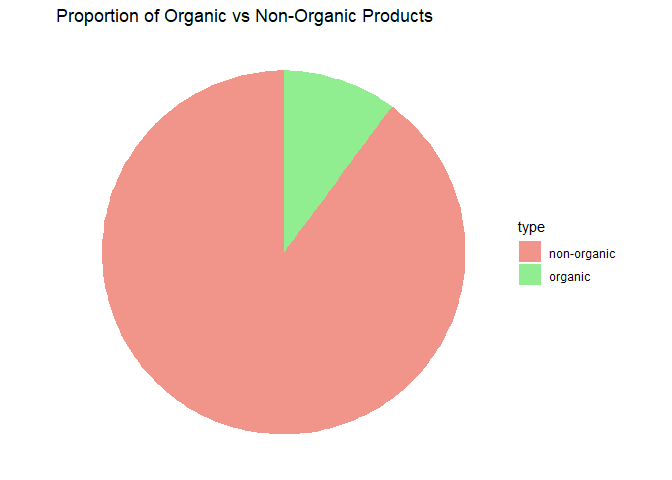

# **introduction**

Welcome to the Market Basket Analysis with R! In this markdown document,
we will explore a dataset of grocery store transactions, conduct
analysis, create visualizations, and derive insights. In a [follow-up
markdown](2_Market_basket_analysis.md) , we will dive deeper by applying
the Apriori algorithm to uncover valuable associations within the data. 

### Key Objectives

The primary goals of this analysis are to:

-   **Understand customer purchasing behaviors and patterns**

-   **Identify key insights to enhance the shopping experience**

-   **Improve product placement and identify opportunities for
    upselling**

### Business Questions of Interest:

Some of the key business questions we aim to answer include:

-   What are the most popular items purchased, and which are the least
    popular?

-   What does the distribution of purchased products look like?

-   Are there any items that are frequently purchased together, and what
    are the strongest product pairings?

-   How can we leverage this information to recommend additional
    products based on a customer’s shopping cart?

### Dataset Overview

For this analysis, we will be working with a dataset from the Instacart
Market Basket Analysis competition on Kaggle [link to the
dataset](https://www.kaggle.com/c/instacart-market-basket-analysis).
This dataset includes the following five files, each providing valuable
insights:

-   **aisles.csv**: Information on the aisles where products are
    located.

-   **departments.csv**: Details on product departments.

-   **order_products.csv**: Data on the specific products purchased in
    each order.

-   **orders.csv**: Records of customer orders.

-   **products.csv**: Details on individual products.

Without further ado, let’s dive in and begin exploring the data!

# **Data exploring**

first lets import some libraries that we are going to use.

    library(tidyverse)
    library(ggplot2)
    library(DataExplorer)
    library(lubridate)

Importing Datasets:

    orders_products <- read.csv("data/order_products__train.csv")
    orders <- read.csv("data/orders.csv")
    products <- read.csv("data/products.csv")
    aisles <- read.csv("data/aisles.csv")
    departments <- read.csv("data/departments.csv")

### Dataset: order_products

Let’s take a look at this dataset.

    glimpse(orders_products)

    ## Rows: 1,384,617
    ## Columns: 4
    ## $ order_id          <int> 1, 1, 1, 1, 1, 1, 1, 1, 36, 36, 36, 36, 36, 36, 36, …
    ## $ product_id        <int> 49302, 11109, 10246, 49683, 43633, 13176, 47209, 220…
    ## $ add_to_cart_order <int> 1, 2, 3, 4, 5, 6, 7, 8, 1, 2, 3, 4, 5, 6, 7, 8, 1, 2…
    ## $ reordered         <int> 1, 1, 0, 0, 1, 0, 0, 1, 0, 1, 0, 1, 1, 1, 1, 1, 0, 0…

Let’s examine how many orders and products we have.

    length(unique(orders_products$order_id)) 

    ## [1] 131209

    length(unique(orders_products$product_id))

    ## [1] 39123

**Let’s examine the distribution of the number of products in orders.**

    n_product_by_orders <- orders_products %>% 
      group_by(order_id) %>% 
      summarise(n_product= n()) 

    summary(n_product_by_orders$n_product)

    ##    Min. 1st Qu.  Median    Mean 3rd Qu.    Max. 
    ##    1.00    5.00    9.00   10.55   14.00   80.00

As you can see, the minimum number of products in an order is 1, while
the maximum is 80. Let’s explore some `visualizations` to gain further
insights.

    n_product_by_orders %>% 
      ggplot(aes(n_product))+
      geom_histogram(binwidth = 1 ,fill="#8ea3a3" , color='#a4c445')+
      labs(title = "distribution of the number of products")

Let’s create a report for this dataset.

    create_report(orders_products, 
                  output_file = "reports/orders_products_report.html", 
                  y = NULL, 
                  config = configure_report(add_plot_missing = F,
                                            add_plot_intro=F,
                                            add_plot_str = F,
                                            add_plot_correlation = F,
                  )
    )

take a look at the [report for
order-product](reports/orders_products_report.html)

    #Since we no longer need the variable `n_product_by_orders`, let's remove it from memory to clean up.

    rm(n_product_by_orders)

### Dataset: orders

    head(orders)

    ##   order_id user_id eval_set order_number order_dow order_hour_of_day
    ## 1  2539329       1    prior            1         2                 8
    ## 2  2398795       1    prior            2         3                 7
    ## 3   473747       1    prior            3         3                12
    ## 4  2254736       1    prior            4         4                 7
    ## 5   431534       1    prior            5         4                15
    ## 6  3367565       1    prior            6         2                 7
    ##   days_since_prior_order
    ## 1                     NA
    ## 2                     15
    ## 3                     21
    ## 4                     29
    ## 5                     28
    ## 6                     19

**Let’s analyze the time intervals between orders**

    summary(orders$days_since_prior_order)

    ##    Min. 1st Qu.  Median    Mean 3rd Qu.    Max.    NA's 
    ##    0.00    4.00    7.00   11.11   15.00   30.00  206209

    #Let's see the percentage of data entries without `days_since_prior_order`.
    round(sum(is.na(orders$days_since_prior_order))/nrow(orders) , 2)

    ## [1] 0.06

Some of these missing values might be due to first-time purchases, but
overall, it’s not a large proportion.

    ggplot(orders , aes(days_since_prior_order))+geom_histogram(fill="gray" , color="darkblue" )+
      labs(title = "distribution of the gap between orders")

**Let’s see the distribution of orders by hour of the day.**

    ggplot(orders , aes(order_hour_of_day))+geom_histogram(fill="gray" ,binwidth = 1, color="#DE3163" )+
      labs(title = "distribution number of orders in each hour")

**orders in days of the week**

    hist(orders$order_dow,          # "Suggests" 14 bins
         freq   = FALSE,       # Axis shows density, not freq.
         col    = "thistle1",  # Color for histogram
         main   = paste("Histogram of Annual Canadian Lynx",
                        "Trappings, 1821-1934"),
         xlab   = "Number of Lynx Trapped")

it seems like we get a few more orders in the first tow days of the week

    create_report(orders, 
                  output_file = "reports/orders.html", 
                  y = NULL, 
                  config = configure_report(
                                            add_plot_intro=F,
                                            add_plot_str = F,
                  ))

check out the [report for the orders](reports/orders.html)

### Dataset: products

have look at the data set

    glimpse(products)

    ## Rows: 49,688
    ## Columns: 4
    ## $ product_id    <int> 1, 2, 3, 4, 5, 6, 7, 8, 9, 10, 11, 12, 13, 14, 15, 16, 1…
    ## $ product_name  <chr> "Chocolate Sandwich Cookies", "All-Seasons Salt", "Robus…
    ## $ aisle_id      <int> 61, 104, 94, 38, 5, 11, 98, 116, 120, 115, 31, 119, 11, …
    ## $ department_id <int> 19, 13, 7, 1, 13, 11, 7, 1, 16, 7, 7, 1, 11, 17, 18, 19,…

Let’s examine the proportion of products that are `organic` versus
`non-organic`.

    products %>%
      mutate(type = ifelse(grepl("Organic", product_name) , "organic" ,"non-organic")) %>%
      group_by(type) %>%
      summarise(count = n(), .groups = 'drop') %>%  # Added .groups = 'drop' to avoid warning
      ggplot(aes(x = "", y = count, fill = type)) +
      geom_bar(width = 1, stat = "identity") +
      coord_polar(theta = "y") +
      labs(title = "Proportion of Organic vs Non-Organic Products") +
      theme_void() +
      scale_fill_manual(values = c("organic" = "lightgreen", "non-organic" = "#f1948a"))

    create_report(orders, 
                  output_file = "reports/products_report.html" , 
                  y = NULL,  )

check out the [report for the products](reports/products_report.html)

### Dataset: aisles and departments

    head(aisles)

    ##   aisle_id                      aisle
    ## 1        1      prepared soups salads
    ## 2        2          specialty cheeses
    ## 3        3        energy granola bars
    ## 4        4              instant foods
    ## 5        5 marinades meat preparation
    ## 6        6                      other

    head(departments)

    ##   department_id    department
    ## 1             1        frozen
    ## 2             2         other
    ## 3             3        bakery
    ## 4             4       produce
    ## 5             5       alcohol
    ## 6             6 international

Let’s now join all the datasets together to build a complete dataset.

    JOINED <- inner_join(orders_products , orders , by="order_id")
    JOINED <- inner_join(JOINED , products , "product_id")
    JOINED <- inner_join(JOINED , aisles , "aisle_id")
    JOINED <- inner_join(JOINED , departments , "department_id")

    write.csv(JOINED , "data/JOINED.csv" , row.names = F)

    View(head(JOINED))

    ncol(JOINED)

    ## [1] 15

    nrow(JOINED)

    ## [1] 1384617

# **Analizing the Data**

Now, we are going to use the joined dataset to uncover `insights` and
create `visualizations`.

let’s build a frequency table and see the most popular products

    frequency_product <- JOINED %>% 
      group_by(product_name ) %>% 
      summarise(count = n()) %>% 
      arrange(desc(count))

    top_n(frequency_product , 10)

    ## # A tibble: 10 × 2
    ##    product_name           count
    ##    <chr>                  <int>
    ##  1 Banana                 18726
    ##  2 Bag of Organic Bananas 15480
    ##  3 Organic Strawberries   10894
    ##  4 Organic Baby Spinach    9784
    ##  5 Large Lemon             8135
    ##  6 Organic Avocado         7409
    ##  7 Organic Hass Avocado    7293
    ##  8 Strawberries            6494
    ##  9 Limes                   6033
    ## 10 Organic Raspberries     5546

yeyy banana , I love banana :)

lets see the most popular aisles

    frequency_aisle <- JOINED %>% 
      group_by(aisle ) %>% 
      summarise(count = n()) %>% 
      arrange(desc(count))

    top_n(frequency_aisle , 10)

    ## # A tibble: 10 × 2
    ##    aisle                          count
    ##    <chr>                          <int>
    ##  1 fresh vegetables              150609
    ##  2 fresh fruits                  150473
    ##  3 packaged vegetables fruits     78493
    ##  4 yogurt                         55240
    ##  5 packaged cheese                41699
    ##  6 water seltzer sparkling water  36617
    ##  7 milk                           32644
    ##  8 chips pretzels                 31269
    ##  9 soy lactosefree                26240
    ## 10 bread                          23635

    JOINED %>% 
      group_by(product_name, aisle ) %>% 
      summarise(count = n()) %>% 
      arrange(desc(count)) %>% 
      head() %>% 
      ggplot(aes(x = reorder(product_name , count) , y = count, fill = aisle))+
      geom_bar(stat = "identity")+
      coord_flip()+
      labs(title = "top 6 most purchased products and their aisle")

Let’s check if there are any products that were purchased only once.

    frequency_product %>% 
      filter(count == 1)

    ## # A tibble: 7,884 × 2
    ##    product_name                                      count
    ##    <chr>                                             <int>
    ##  1 #2 Cone White Coffee Filters                          1
    ##  2 #2 Mechanical Pencils                                 1
    ##  3 +Energy Black Cherry Vegetable & Fruit Juice          1
    ##  4 1 Step-1 Minute Noodles Toasted Sesame                1
    ##  5 1% Hydrocortisone Anti-Itch Cream, Tube Anti-Itch     1
    ##  6 1% Lowfat Cultured Buttermilk                         1
    ##  7 1% Lowfat Vanilla Milk                                1
    ##  8 1,000 Mg Vitamin C Super Orange                       1
    ##  9 1/4 Pound Burgers                                     1
    ## 10 10 Tostada Shells                                     1
    ## # ℹ 7,874 more rows

Let’s examine the percentage of one-time-purchased products in the
dataset.

    frequency_product %>% 
      filter(count == 1) %>% 
      nrow() / nrow(frequency_product)

    ## [1] 0.2015183

    frequency_product <-  frequency_product %>% 
      mutate(percent = count / nrow(frequency_product)) %>% 
      mutate(rank = rank(desc(count))) 

    head(frequency_product)

    ## # A tibble: 6 × 4
    ##   product_name           count percent  rank
    ##   <chr>                  <int>   <dbl> <dbl>
    ## 1 Banana                 18726   0.479     1
    ## 2 Bag of Organic Bananas 15480   0.396     2
    ## 3 Organic Strawberries   10894   0.278     3
    ## 4 Organic Baby Spinach    9784   0.250     4
    ## 5 Large Lemon             8135   0.208     5
    ## 6 Organic Avocado         7409   0.189     6

Let’s examine the number of purchases made by each customer and sort
them from highest to lowest to identify the maximum.

    JOINED %>% 
      group_by(user_id ) %>% 
      summarise(numberOfPurches = n()) %>% 
      arrange(desc(numberOfPurches))

    ## # A tibble: 131,209 × 2
    ##    user_id numberOfPurches
    ##      <int>           <int>
    ##  1  149753              80
    ##  2  197541              80
    ##  3   63458              77
    ##  4   83993              76
    ##  5  189951              76
    ##  6  169647              75
    ##  7   31611              74
    ##  8  104741              74
    ##  9   59321              72
    ## 10  181991              72
    ## # ℹ 131,199 more rows

Now that we have a good understanding of the data and have extracted
some valuable insights, the next step is to conduct a market basket
analysis to discover potential correlation rules.

Check out the [Market Basket Analysis](2_Market_basket_analysis.md)
kernel.
