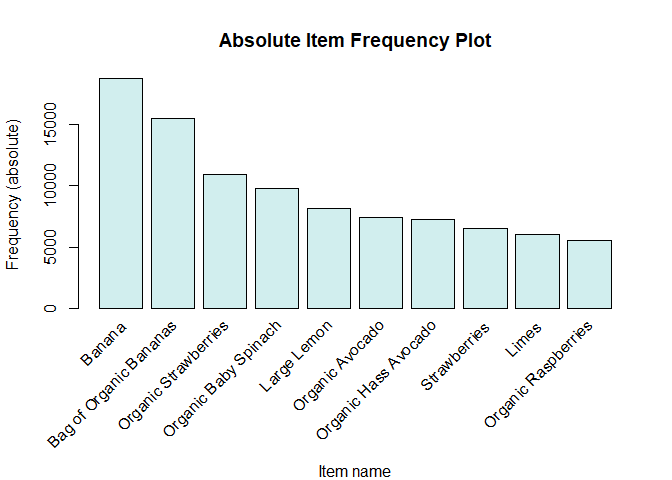
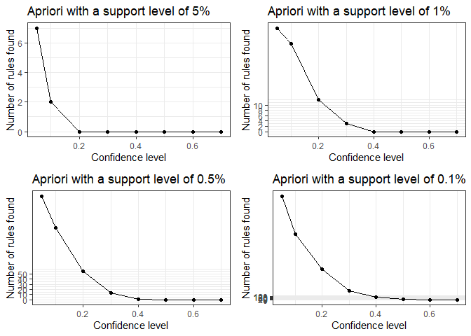
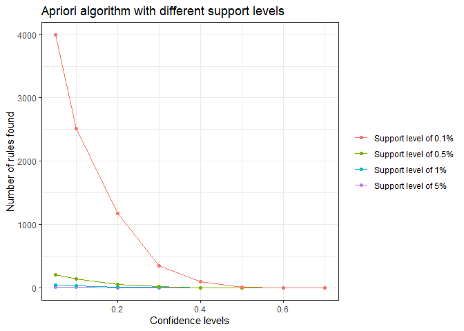
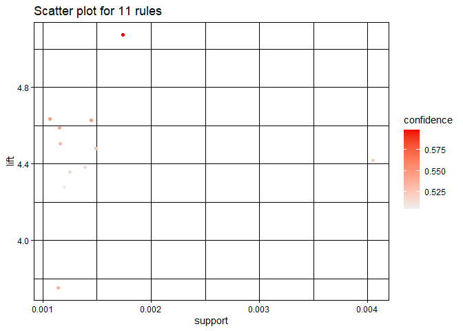

-   [**Introduction**](#introduction)
    -   [Key Objectives](#key-objectives)
    -   [Importing the data](#importing-the-data)
-   [**Selecting the Optimal Values for
    Parameters**](#selecting-the-optimal-values-for-parameters)
-   [**Analysis & Association Rules**](#analysis-association-rules)
-   [**Conclusion**](#conclusion)

# **Introduction**

Hi! In this kernel we are going to use the **Apriori algorithm** to
perform a **Market Basket Analysis**. It’s a technique used by large
retailers to uncover associations between items. It works by looking for
combinations of items that occur together frequently in transactions,
providing information to understand the purchase behavior. The outcome
of this type of technique is, in simple terms, a set of **rules** that
can be understood as **“if this, then that”**.

### Key Objectives

***Market Basket Analysis & Association Rules***

In this section we use association rules and the a priori algorithm to
identify purchase patterns and answer the following questions:

-   Do customers purchase items together frequently and which products
    are most often purchased together ?

-   Can we use this information to recommend other products based on a
    customer’s cart ?

### Importing the data

First, let’s import the required libraries.

    library(arules)
    library(arulesViz)
    library(tidyverse)
    library(ggplot2)
    library(DataExplorer)
    library(gridExtra)

let’s see the data set that we built by joining all datasets

    JOINED <- read.csv("data/JOINED.csv")
    head(JOINED)

    ##   order_id product_id add_to_cart_order reordered user_id eval_set order_number
    ## 1        1      49302                 1         1  112108    train            4
    ## 2        1      11109                 2         1  112108    train            4
    ## 3        1      10246                 3         0  112108    train            4
    ## 4        1      49683                 4         0  112108    train            4
    ## 5        1      43633                 5         1  112108    train            4
    ## 6        1      13176                 6         0  112108    train            4
    ##   order_dow order_hour_of_day days_since_prior_order
    ## 1         4                10                      9
    ## 2         4                10                      9
    ## 3         4                10                      9
    ## 4         4                10                      9
    ## 5         4                10                      9
    ## 6         4                10                      9
    ##                                    product_name aisle_id department_id
    ## 1                              Bulgarian Yogurt      120            16
    ## 2 Organic 4% Milk Fat Whole Milk Cottage Cheese      108            16
    ## 3                         Organic Celery Hearts       83             4
    ## 4                                Cucumber Kirby       83             4
    ## 5          Lightly Smoked Sardines in Olive Oil       95            15
    ## 6                        Bag of Organic Bananas       24             4
    ##                  aisle   department
    ## 1               yogurt   dairy eggs
    ## 2 other creams cheeses   dairy eggs
    ## 3     fresh vegetables      produce
    ## 4     fresh vegetables      produce
    ## 5  canned meat seafood canned goods
    ## 6         fresh fruits      produce

To apply the `Apriori` algorithm in `market basket analysis`, we need to
have a **transactions** dataset. We can import the dataset in the
required transaction format using the `arules` library. For this, we’ll
need the columns for transaction ID and product name.

    JOINED[1,c(1,11)]

    ##   order_id     product_name
    ## 1        1 Bulgarian Yogurt

As you can see, the `transactionId` and `productName` columns are in
positions 1 and 11, respectively.

let’s imprort the dataset as transactions. (columns 1 and 11)

    rm(JOINED)
    trans <- read.transactions("data/JOINED.csv" , format = "single" , sep = "," , cols = c(1 ,11))
    trans

    ## transactions in sparse format with
    ##  131210 transactions (rows) and
    ##  39124 items (columns)

let’s see the first transaction

    inspect(trans[1])

    ##     items                                            transactionID
    ## [1] {Bag of Organic Bananas,                                      
    ##      Bulgarian Yogurt,                                            
    ##      Cucumber Kirby,                                              
    ##      Lightly Smoked Sardines in Olive Oil,                        
    ##      Organic 4% Milk Fat Whole Milk Cottage Cheese,               
    ##      Organic Celery Hearts,                                       
    ##      Organic Hass Avocado,                                        
    ##      Organic Whole String Cheese}                                1

With the `itemFrequencyPlot`, we can again visualize a graph of the most
popular products.

    itemFrequencyPlot(trans ,topN=10 , type="absolute" ,col="lightcyan2",xlab="Item name", 
                      ylab="Frequency (absolute)", main="Absolute Item Frequency Plot")

# **Selecting the Optimal Values for Parameters**

The Apriori algorithm generates association rules for a given dataset.
An association rule suggests that if item A occurs, then item B is
likely to occur with a certain probability.

To extract these rules using the Apriori algorithm, there are three key
arguments that are crucial for obtaining the best rules:

-   **Support**: Indicates how frequently the itemset appears in the
    dataset.
-   **Confidence**: Reflects how often the rule has been found to be
    true.
-   **Lift**: Represents the ratio of the observed support to that
    expected if X and Y were independent. If the lift is greater than 1,
    it indicates the strength of the relationship between the two items,
    showing how dependent they are on each other.

Now, we will use the `gridExtra` package to build different rules with
varying parameters and plot them to determine which set of rules is the
most suitable.

    # Support and confidence values
    supportLevels <- c( 0.05, 0.01, 0.005 , 0.001)
    confidenceLevels <- c(  0.7, 0.6, 0.5, 0.4, 0.3, 0.2, 0.1 , 0.05 , 0.1)

    # Empty integers 
    rules_sup5 <- integer(length=9)
    rules_sup1 <- integer(length=9)
    rules_sup0.5 <- integer(length=9)
    rules_sup0.1 <- integer(length=9)

We will test `support values` of 5, 1, 0.5, and 0.1, along with
`confidence values` of 0.7, 0.6, 0.5, 0.4, 0.3, 0.2, 0.1, 0.05, and 0.01
to determine which combination of these two parameters works best
together.

    # Apriori algorithm with a support level of 5%
    for (i in 1:length(confidenceLevels)) {
      
      rules_sup5[i] <- length(apriori(trans, parameter=list(sup=supportLevels[1], 
                                                             conf=confidenceLevels[i],target="rules"), 
                                    control = list(verbose = FALSE)))
    }

    # Apriori algorithm with a support level of 1%
    for (i in 1:length(confidenceLevels)){
      
      rules_sup1[i] <- length(apriori(trans, parameter=list(sup=supportLevels[2], 
                                                            conf=confidenceLevels[i], target="rules"), 
                                    control = list(verbose = FALSE)))
    }

    # Apriori algorithm with a support level of 0.5%
    for (i in 1:length(confidenceLevels)){
      
      rules_sup0.5[i] <- length(apriori(trans, parameter=list(sup=supportLevels[3], 
                                                            conf=confidenceLevels[i],target="rules"), 
                                    control = list(verbose = FALSE)))
    }

    # Apriori algorithm with a support level of 0.1%
    for (i in 1:length(confidenceLevels)){
      
      rules_sup0.1[i] <- length(apriori(trans, parameter=list(sup=supportLevels[4], 
                                                              conf=confidenceLevels[i], target="rules"), 
                                    control = list(verbose = FALSE)))
    }

    rules_sup5 

    ## [1] 0 0 0 0 0 0 2 7 2

    rules_sup1 

    ## [1]  0  0  0  0  3 12 33 39 33

    rules_sup0.5 

    ## [1]   0   0   0   1  13  55 141 203 141

    rules_sup0.1

    ## [1]    0    0   11   89  347 1172 2519 3992 2519

***Now, let’s plot the number of rules generated for each confidence
level at each support level.***

    # Number of rules found with a support level of 5%
    plot1 <- qplot(confidenceLevels, rules_sup5, geom=c("point", "line"), 
                   xlab="Confidence level", ylab="Number of rules found", 
                   main="Apriori with a support level of 5%") +
      theme_bw()

    # Number of rules found with a support level of 1%
    plot2 <- qplot(confidenceLevels, rules_sup1, geom=c("point", "line"), 
                   xlab="Confidence level", ylab="Number of rules found", 
                   main="Apriori with a support level of 1%") + 
      scale_y_continuous(breaks=seq(0, 10, 2)) +
      theme_bw()

    # Number of rules found with a support level of 0.5%
    plot3 <- qplot(confidenceLevels, rules_sup0.5, geom=c("point", "line"), 
                   xlab="Confidence level", ylab="Number of rules found", 
                   main="Apriori with a support level of 0.5%") + 
      scale_y_continuous(breaks=seq(0, 50, 10)) +
      theme_bw()

    # Number of rules found with a support level of 0.1%
    plot4 <- qplot(confidenceLevels, rules_sup0.1, geom=c("point", "line"), 
                   xlab="Confidence level", ylab="Number of rules found", 
                   main="Apriori with a support level of 0.1%") + 
      scale_y_continuous(breaks=seq(0, 130, 20)) +
      theme_bw()

    # Subplot
    grid.arrange(plot1, plot2, plot3, plot4, ncol=2)

***Let’s plot them all together so we can compare them.***

    num_rules <- data.frame(rules_sup5, rules_sup1, rules_sup0.5, rules_sup0.1, confidenceLevels)

    # Number of rules found with a support level of 10%, 5%, 1% and 0.5%
    ggplot(data=num_rules, aes(x=confidenceLevels)) +
      
      # Plot line and points (support level of 10%)
      geom_line(aes(y=rules_sup5, colour="Support level of 5%")) + 
      geom_point(aes(y=rules_sup5, colour="Support level of 5%")) +
      
      # Plot line and points (support level of 5%)
      geom_line(aes(y=rules_sup1, colour="Support level of 1%")) +
      geom_point(aes(y=rules_sup1, colour="Support level of 1%")) +
      
      # Plot line and points (support level of 1%)
      geom_line(aes(y=rules_sup0.5, colour="Support level of 0.5%")) + 
      geom_point(aes(y=rules_sup0.5, colour="Support level of 0.5%")) +
      
      # Plot line and points (support level of 0.5%)
      geom_line(aes(y=rules_sup0.1, colour="Support level of 0.1%")) +
      geom_point(aes(y=rules_sup0.1, colour="Support level of 0.1%")) +
      
      # Labs and theme
      labs(x="Confidence levels", y="Number of rules found", 
           title="Apriori algorithm with different support levels") +
      theme_bw() +
      theme(legend.title=element_blank())

# **Analysis & Association Rules**

Let’s use a support level of 1% and a confidence level of 0% for this
analysis.
`Note: In the real world, this level of support and confidence may not be sufficient, and we typically rely on stronger evidence`.

    rules <- apriori(trans, parameter=list(sup=supportLevels[4], 
                                                       conf=confidenceLevels[3], target="rules"), 
                                    control = list(verbose = FALSE))
    rules

    ## set of 11 rules

    inspect(head(rules))

    ##     lhs                                  rhs                          support confidence    coverage     lift count
    ## [1] {Organic Broccoli,                                                                                             
    ##      Organic Hass Avocado}            => {Bag of Organic Bananas} 0.001196555  0.5048232 0.002370246 4.278931   157
    ## [2] {Organic Hass Avocado,                                                                                         
    ##      Organic Unsweetened Almond Milk} => {Bag of Organic Bananas} 0.001249905  0.5141066 0.002431217 4.357618   164
    ## [3] {Organic Navel Orange,                                                                                         
    ##      Organic Raspberries}             => {Bag of Organic Bananas} 0.001150827  0.5412186 0.002126362 4.587422   151
    ## [4] {Organic Hass Avocado,                                                                                         
    ##      Organic Navel Orange}            => {Bag of Organic Bananas} 0.001493789  0.5283019 0.002827528 4.477939   196
    ## [5] {Organic Hass Avocado,                                                                                         
    ##      Organic Kiwi}                    => {Bag of Organic Bananas} 0.001448060  0.5459770 0.002652237 4.627755   190
    ## [6] {Organic D'Anjou Pears,                                                                                        
    ##      Organic Hass Avocado}            => {Bag of Organic Bananas} 0.001387089  0.5170455 0.002682722 4.382528   182

    plot(rules, measure=c("support", "lift"), shading="confidence")

    plot(rules, method="graph")

***Now, I want to explore 4-product associations to determine if
purchasing products A, B, and C increases the likelihood of purchasing
product D.***

    rules <- apriori(trans, parameter=list(sup=supportLevels[4], 
                                                       conf=confidenceLevels[4],minlen =4 , maxlen=4, target="rules"), 
                                    control = list(verbose = FALSE))
    rules

    ## set of 6 rules

    inspect(head(rules))

    ##     lhs                          rhs                          support confidence    coverage     lift count
    ## [1] {Organic Cucumber,                                                                                     
    ##      Organic Hass Avocado,                                                                                 
    ##      Organic Strawberries}    => {Bag of Organic Bananas} 0.001066992  0.5468750 0.001951071 4.635366   140
    ## [2] {Organic Hass Avocado,                                                                                 
    ##      Organic Raspberries,                                                                                  
    ##      Organic Strawberries}    => {Bag of Organic Bananas} 0.001737672  0.5984252 0.002903742 5.072311   228
    ## [3] {Bag of Organic Bananas,                                                                               
    ##      Organic Hass Avocado,                                                                                 
    ##      Organic Raspberries}     => {Organic Strawberries}   0.001737672  0.4293785 0.004046948 5.171540   228
    ## [4] {Banana,                                                                                               
    ##      Limes,                                                                                                
    ##      Organic Avocado}         => {Large Lemon}            0.001112720  0.4147727 0.002682722 6.689899   146
    ## [5] {Large Lemon,                                                                                          
    ##      Organic Avocado,                                                                                      
    ##      Organic Baby Spinach}    => {Banana}                 0.001021264  0.4011976 0.002545538 2.811126   134
    ## [6] {Organic Baby Spinach,                                                                                 
    ##      Organic Hass Avocado,                                                                                 
    ##      Organic Strawberries}    => {Bag of Organic Bananas} 0.001242283  0.4939394 0.002515052 4.186679   163

# **Conclusion**

-   Using association rules we have identfied items that customers
    purchase together frequently and which products are most often
    purchased together

-   In addition, we have an apriori model that we can use to recommend
    instcart customer products based their existing cart !
